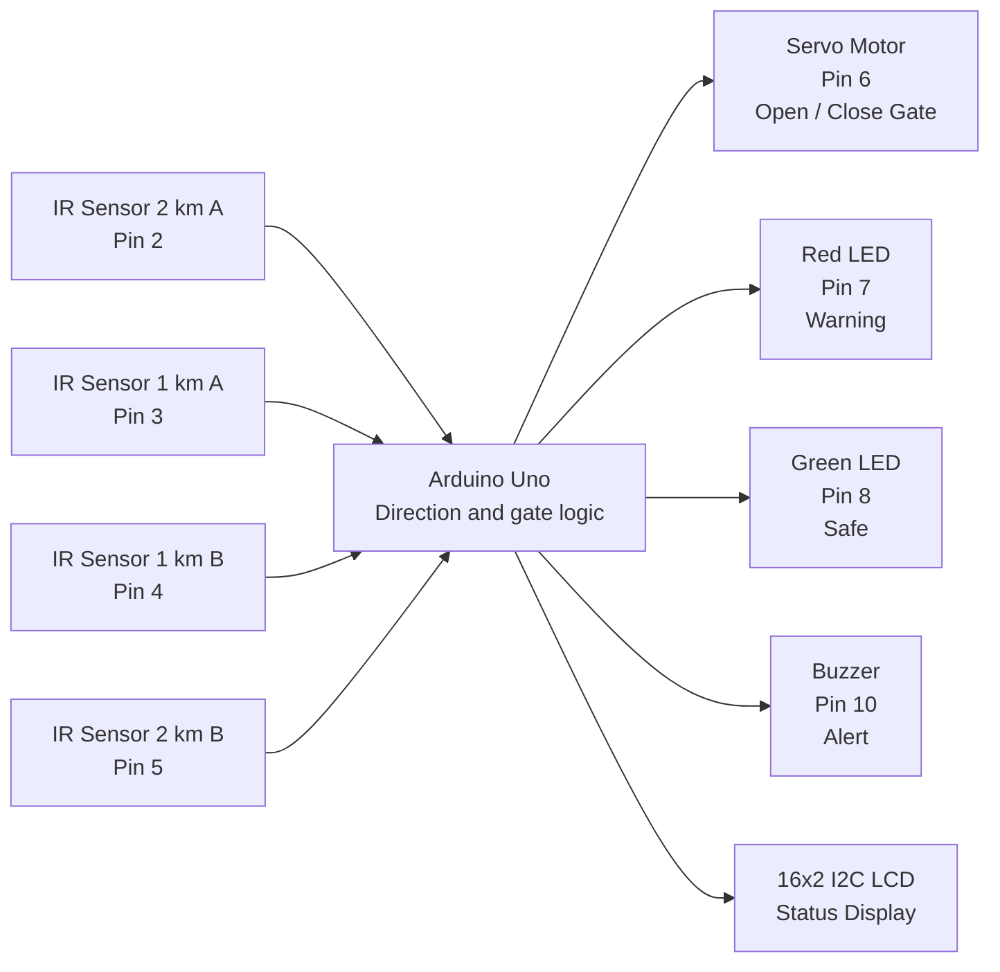

# Automated Railway Gate System using IoT

## 1. Project Overview
The Automated Railway Gate System using IoT is a smart safety project designed to automate railway gate operations. It reduces the need for manual gate control and improves safety at railway crossings by detecting train movement and controlling the gate automatically.

## 2. Objective of the Project
- Prevent accidents at railway crossings
- Automate gate closing and opening
- Provide real-time status updates using LEDs, LCD, and buzzer
- Support two-way train movement

## 3. What is the Project About?
This project uses four digital IR obstacle sensors to detect the movement of a train model at different locations. When the train approaches the gate, the system closes the gate and alerts people. After the train passes, the gate opens again automatically.

## 4. IoT Components Used
- Arduino Uno / compatible microcontroller
- IR obstacle sensors (4 units)
- Reflective markers or the train body detected by the IR sensors
- Servo motor for gate movement
- 16x2 I2C LCD display
- Red and green LEDs
- Buzzer
- Breadboard and jumper wires

## 5. Simple System Architecture

### Pin Connections
| Component | Arduino pin | Function |
|---|---:|---|
| IR sensor 2 km A | 2 | Detects train approaching from A |
| IR sensor 1 km A | 3 | Detects train near the gate from A |
| IR sensor 1 km B | 4 | Detects train near the gate from B |
| IR sensor 2 km B | 5 | Detects train approaching from B / confirms exit |
| Servo motor | 6 | Opens and closes the gate |
| Red LED | 7 | Warning or gate closed |
| Green LED | 8 | Safe or gate open |
| Buzzer | 10 | Audible warning |
| I2C LCD | SDA/SCL | Displays system status |

## 6. How the System Works
1. IR sensors detect the train at different positions.
2. The system identifies whether the train is moving from track A to B or B to A based on sensor order.
3. The servo motor closes the gate when the train approaches.
4. The buzzer and LEDs warn people about the arriving train.
5. After the train passes, the system opens the gate automatically.

## 7. Features of the Project
- Automatic gate control
- Train detection using IR sensors
- Visual and sound alerts
- LCD status display
- Two-way movement support
- Low-cost and simple implementation

## 8. Applications
- Railway crossings
- Smart transportation systems
- Educational IoT projects
- Prototype railway automation systems

## 9. Advantages
- Increases safety
- Reduces manual labor
- Low cost and easy to build
- Useful for learning embedded systems and IoT

## 10. Limitations
- Works best for a prototype model
- IR detection depends on sensor alignment, distance, lighting, and reflective surfaces
- Real railway systems need more advanced sensors and communication modules

## 11. Interview Questions and Answers
### Q1. What is this project about?
A. It is an Arduino-based automated railway gate control system that detects train movement with four IR sensors and opens or closes the gate automatically.

### Q2. Which microcontroller is used in this project?
A. Arduino Uno is used as the main controller.

### Q3. What technology is used to detect the train?
A. Four digital IR obstacle sensors are placed at two distances on each side of the crossing. Their trigger order identifies the train direction.

### Q4. What is the role of the servo motor?
A. The servo motor physically moves the railway gate to open or close it.

### Q5. Why are LEDs and buzzer used?
A. They provide visual and sound alerts when a train is approaching.

### Q6. What does the LCD display show?
A. It shows the current status such as train approach, passing, or gate open/close status.

### Q7. How does the system handle both directions of train movement?
A. The project uses four IR sensors. The outer sensor detects approach, the inner sensor confirms the train is near, and the sensors on the opposite side confirm passage.

### Q8. What are the main advantages of this project?
A. It improves safety, reduces manual effort, and automates the gate operation.

### Q9. Is this project suitable for real railway systems?
A. It is a good prototype and learning project, but real railway systems need more advanced and reliable hardware.

### Q10. What can be improved in the future?
A. The system can be upgraded with IoT cloud integration, GPS, camera-based detection, and real-time monitoring.
